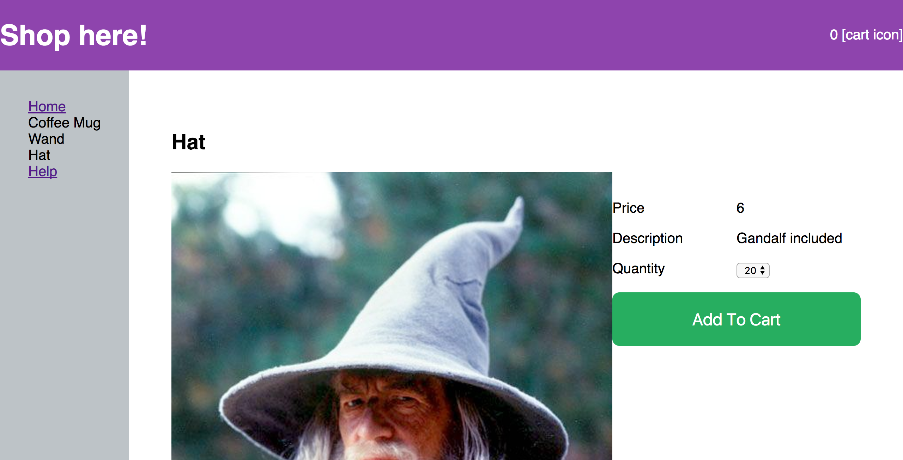

Simplistic Example React app with Props
============================

* The link in Aside selects the product shown
* The button in Product affets the header

```jsx
<App>
  <header />
  <Aside>
    {products.map( product => <Link product={product}
    onClick={this.handleProductSelection} )}
  </Aside>
  <Product product={this.state.product} onClick={this.handleAddToCart} />
</App>
```



Get Started
-----

1. Clone
2. `yarn`
3. `yarn start`
